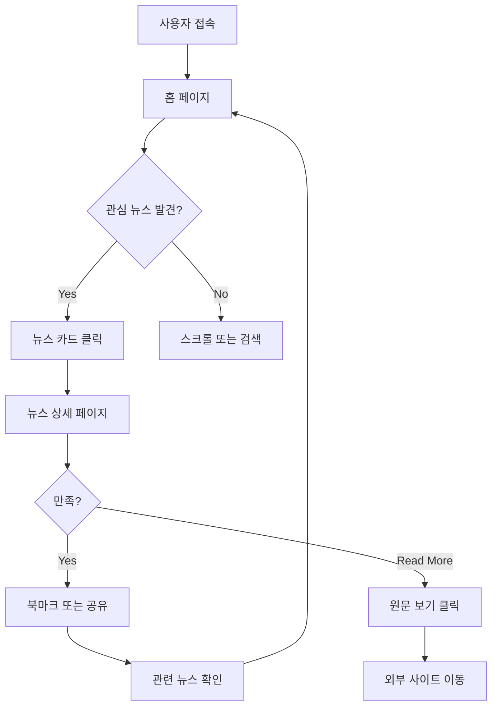
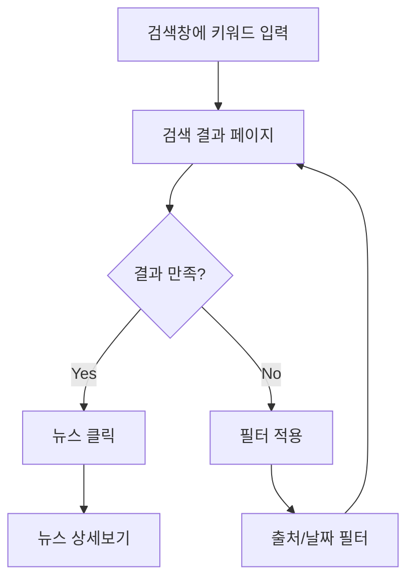
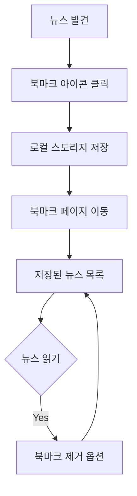
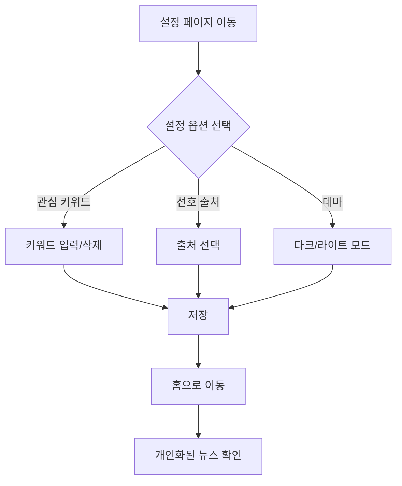

# Tech Daily - 기술 뉴스 애그리게이터 PRD

**문서 버전**: 1.0
**작성일**: 2025-12-15
**작성자**: Product Team
**상태**: Draft

---

## 목차
1. [프로젝트 개요](#1-프로젝트-개요)
2. [기능 요구사항](#2-기능-요구사항)
3. [기술 스택](#3-기술-스택)
4. [비기능 요구사항](#4-비기능-요구사항)
5. [데이터 모델](#5-데이터-모델)
6. [API 설계](#6-api-설계)
7. [페이지 구조 및 라우팅](#7-페이지-구조-및-라우팅)
8. [RSS 피드 소스](#8-rss-피드-소스)
9. [사용자 플로우](#9-사용자-플로우)
10. [UI/UX 가이드라인](#10-uiux-가이드라인)
11. [개발 로드맵](#11-개발-로드맵)
12. [성공 지표 (KPI)](#12-성공-지표-kpi)
13. [리스크 및 제약사항](#13-리스크-및-제약사항)
14. [부록](#부록)

---

## 1. 프로젝트 개요

### 1.1 프로젝트 비전

Tech Daily는 **기술 업계 종사자와 기술에 관심 있는 사용자들이 한국과 해외의 최신 기술 뉴스를 한 곳에서 편리하게 확인할 수 있는 뉴스 애그리게이터 플랫폼**입니다.

다양한 뉴스 소스를 일일이 방문하지 않고도, Tech Daily에서 개인화된 기술 뉴스를 큐레이션하여 받아볼 수 있습니다.

### 1.2 목표

**비즈니스 목표**:
- 기술 뉴스 소비의 중앙 허브 구축
- 일일 활성 사용자 1,000명 달성 (런칭 후 3개월)
- 평균 세션 시간 5분 이상 유지
- 사용자 리텐션율 40% 이상 (주간 기준)

**사용자 목표**:
- 여러 뉴스 소스를 하나의 플랫폼에서 확인
- 개인 관심사에 맞는 뉴스 추천 받기
- 중요한 뉴스를 북마크하여 나중에 읽기
- 깔끔하고 빠른 사용자 경험 제공

### 1.3 타겟 사용자

**주요 타겟 사용자**:

| 페르소나 | 특성 | 니즈 |
|---------|------|------|
| **개발자 (Developer)** | 20-40대, 현업 개발자, 최신 기술 트렌드 관심 | 프로그래밍 언어, 프레임워크, 개발 도구 관련 뉴스 |
| **기술 관심층 (Tech Enthusiast)** | 20-30대, IT 업계 종사자 또는 관심자 | 스타트업, 빅테크, 혁신 기술 뉴스 |
| **학생 (Student)** | 대학생, IT 전공자, 취업 준비생 | 기술 트렌드, 채용 정보, 학습 자료 |

**사용 환경**:
- 데스크톱: 업무 중 빠른 뉴스 확인
- 모바일: 이동 중 뉴스 소비
- 태블릿: 여유 시간에 심층 읽기

### 1.4 핵심 가치 제안

| 가치 제안 | 설명 |
|----------|------|
| **통합된 뉴스 소스** | 한국/해외 주요 기술 뉴스 사이트를 한 곳에서 |
| **개인화된 경험** | 사용자 관심사 기반 뉴스 추천 |
| **깔끔한 UX** | 광고 없는 깔끔한 인터페이스, 빠른 로딩 |
| **북마크 기능** | 나중에 읽을 뉴스 저장 및 관리 |
| **무료 접근** | 회원가입 없이 누구나 사용 가능 |

---

## 2. 기능 요구사항

### 2.1 뉴스 피드

**기능 설명**:
- 메인 페이지에서 최신 기술 뉴스를 카드 형식으로 표시
- 여러 RSS 피드 소스를 통합하여 시간순으로 정렬
- 뉴스 카드에는 썸네일, 제목, 요약, 출처, 발행일 표시

**사용자 시나리오**:
1. 사용자가 Tech Daily 홈페이지에 접속
2. 최신 뉴스가 카드 형식으로 표시됨
3. 스크롤하면 추가 뉴스가 로드됨 (무한 스크롤)
4. 관심 있는 뉴스 카드를 클릭하여 상세보기

**UI/UX 요구사항**:
- 카드 레이아웃: 그리드 형식 (데스크톱 3열, 태블릿 2열, 모바일 1열)
- 각 카드 요소:
  - 썸네일 이미지 (16:9 비율)
  - 뉴스 제목 (최대 2줄)
  - 뉴스 요약 (최대 3줄)
  - 출처 및 발행일
  - 북마크 아이콘
- 무한 스크롤 또는 "더 보기" 버튼
- 로딩 상태 표시 (스켈레톤 UI)

**기술 고려사항**:
- RSS 피드를 서버 측에서 수집 및 파싱
- 피드 캐싱으로 성능 최적화 (15분 간격 갱신)
- 이미지 최적화 (Next.js Image 컴포넌트 사용)

### 2.2 뉴스 상세보기

**기능 설명**:
- 뉴스 카드 클릭 시 상세 페이지로 이동
- 뉴스 전체 내용 표시 (가능한 경우)
- 원문 링크 버튼 제공
- 관련 뉴스 추천

**사용자 시나리오**:
1. 사용자가 뉴스 카드 클릭
2. 상세 페이지로 이동 (`/news/[id]`)
3. 뉴스 전체 내용 확인
4. "원문 보기" 버튼으로 뉴스 사이트 방문 가능
5. 하단에 관련 뉴스 3-5개 추천

**UI/UX 요구사항**:
- 읽기 편한 타이포그래피 (serif 폰트 옵션)
- 뉴스 본문 너비 제한 (max-width: 768px)
- 썸네일 이미지 상단 표시
- 출처, 발행일, 저자 정보
- 소셜 공유 버튼 (트위터, 페이스북, 링크 복사)
- 북마크 버튼
- 관련 뉴스 섹션

**기술 고려사항**:
- RSS feed의 `content:encoded` 또는 `description` 파싱
- 외부 링크는 `target="_blank"` 및 `rel="noopener noreferrer"` 속성
- 동적 라우팅 (`/news/[id]`)
- SSR 또는 SSG로 SEO 최적화

### 2.3 검색 및 필터링

**기능 설명**:
- 키워드 검색: 제목, 요약, 본문에서 검색
- 출처별 필터: 특정 뉴스 소스만 보기
- 날짜 범위 필터: 오늘, 이번 주, 이번 달, 전체
- 카테고리/태그 필터: AI, Web, Mobile 등

**사용자 시나리오**:
1. 사용자가 검색창에 키워드 입력 (예: "React")
2. 검색 결과 페이지로 이동
3. 필터를 적용하여 결과 세분화
4. 검색 결과를 뉴스 피드 형식으로 표시

**UI/UX 요구사항**:
- 헤더에 고정된 검색창
- 검색 자동완성 (인기 키워드)
- 필터 사이드바 또는 드롭다운
- 검색 결과 개수 표시
- 검색어 하이라이트

**기술 고려사항**:
- 클라이언트 측 검색 (작은 데이터셋)
- 또는 서버 측 검색 API 구현
- 디바운싱으로 검색 성능 최적화
- URL 쿼리 파라미터로 검색 상태 관리 (`?q=react&source=techcrunch`)

### 2.4 북마크/저장

**기능 설명**:
- 뉴스를 북마크하여 나중에 읽기
- 북마크 목록 페이지에서 저장된 뉴스 확인
- 북마크 추가/제거
- 로컬 스토리지를 활용한 데이터 저장

**사용자 시나리오**:
1. 사용자가 뉴스 카드의 북마크 아이콘 클릭
2. 북마크가 로컬 스토리지에 저장됨
3. 북마크 페이지(`/bookmarks`)에서 저장된 뉴스 확인
4. 북마크 제거 가능

**UI/UX 요구사항**:
- 북마크 아이콘 (빈 하트 → 꽉 찬 하트)
- 북마크 추가/제거 시 애니메이션
- 북마크 페이지: 저장된 뉴스를 카드 형식으로 표시
- 빈 상태 UI (북마크가 없을 때)
- 북마크 수 뱃지 (헤더 네비게이션)

**기술 고려사항**:
- 로컬 스토리지로 북마크 데이터 관리
- JSON 형식으로 저장: `{ newsId, savedAt }`
- React Context 또는 Zustand로 상태 관리
- 북마크 동기화 고려 (추후 사용자 인증 추가 시)

### 2.5 개인화 추천

**기능 설명**:
- 사용자의 읽은 뉴스 기록을 바탕으로 관심사 파악
- 관심 키워드 기반 뉴스 추천
- 선호 출처 설정 기능

**사용자 시나리오**:
1. 사용자가 설정 페이지에서 관심 키워드/출처 설정
2. 또는 자동으로 읽은 뉴스에서 키워드 추출
3. 홈 페이지에 "추천 뉴스" 섹션 표시
4. 사용자 관심사에 맞는 뉴스 우선 표시

**UI/UX 요구사항**:
- 설정 페이지: 관심 키워드 입력 (태그 형식)
- 선호 출처 체크박스
- "추천" 탭과 "최신" 탭 전환
- 추천 이유 표시 (예: "AI에 관심이 있으시군요")

**기술 고려사항**:
- 로컬 스토리지에 읽은 뉴스 ID 저장
- 간단한 키워드 매칭 알고리즘
- TF-IDF 또는 키워드 빈도 분석 (선택)
- 추후 ML 기반 추천 시스템 고려

---

## 3. 기술 스택

### 3.1 프론트엔드

| 기술 | 버전 | 용도 |
|------|------|------|
| **Next.js** | 16.0.10 | React 프레임워크, SSR/SSG, API Routes |
| **React** | 19.2.1 | UI 라이브러리 |
| **TypeScript** | 5.x | 타입 안정성 |
| **Tailwind CSS** | 4.x | 유틸리티 기반 스타일링 |
| **shadcn/ui** | latest | UI 컴포넌트 라이브러리 |
| **lucide-react** | latest | 아이콘 |
| **date-fns** | latest | 날짜 포맷팅 |

### 3.2 백엔드 (API Routes)

| 기술 | 용도 |
|------|------|
| **Next.js API Routes** | 서버리스 API 엔드포인트 |
| **rss-parser** | RSS 피드 파싱 |
| **node-cache** | 인메모리 캐싱 |

### 3.3 데이터 저장

| 저장소 | 용도 |
|--------|------|
| **로컬 스토리지** | 북마크, 읽은 뉴스, 사용자 선호도 |
| **인메모리 캐시** | RSS 피드 데이터 캐싱 |

### 3.4 외부 서비스

| 서비스 | 용도 |
|--------|------|
| **Vercel** | 배포 및 호스팅 |
| **Google Analytics** | 사용자 분석 (선택) |

---

## 4. 비기능 요구사항

### 4.1 성능

| 지표 | 목표 |
|------|------|
| **First Contentful Paint (FCP)** | < 1.5초 |
| **Largest Contentful Paint (LCP)** | < 2.5초 |
| **Time to Interactive (TTI)** | < 3초 |
| **Cumulative Layout Shift (CLS)** | < 0.1 |
| **RSS 피드 갱신 주기** | 15분 |
| **이미지 로딩** | Lazy loading, WebP 포맷 |

**성능 최적화 전략**:
- Next.js Image 컴포넌트로 이미지 최적화
- SSR/SSG로 초기 로딩 속도 개선
- 코드 스플리팅 및 동적 import
- RSS 피드 서버 측 캐싱
- CDN을 통한 정적 자산 배포

### 4.2 보안

| 항목 | 요구사항 |
|------|----------|
| **HTTPS** | 모든 통신 암호화 |
| **XSS 방지** | 사용자 입력 sanitize, React의 기본 escape |
| **CSRF 방지** | API Routes에 CSRF 토큰 (필요 시) |
| **외부 링크** | `rel="noopener noreferrer"` 속성 |
| **콘텐츠 보안 정책** | CSP 헤더 설정 |

### 4.3 접근성

- **WCAG 2.1 AA 수준** 준수
- 시맨틱 HTML 사용
- 키보드 네비게이션 지원
- ARIA 레이블 적절히 사용
- 충분한 색상 대비 (4.5:1 이상)
- 스크린 리더 지원

### 4.4 반응형 디자인

| 디바이스 | 브레이크포인트 | 레이아웃 |
|----------|---------------|----------|
| **모바일** | < 768px | 1열 카드 레이아웃 |
| **태블릿** | 768px - 1024px | 2열 카드 레이아웃 |
| **데스크톱** | > 1024px | 3열 카드 레이아웃 |

### 4.5 SEO

- 메타 태그 최적화 (title, description, og tags)
- 시맨틱 HTML 구조
- sitemap.xml 생성
- robots.txt 설정
- 구조화된 데이터 (JSON-LD)
- 동적 메타 태그 (뉴스 상세 페이지)

---

## 5. 데이터 모델

### 5.1 News

```typescript
interface News {
  id: string;                    // 고유 ID (RSS guid 또는 생성)
  title: string;                 // 뉴스 제목
  description: string;           // 요약
  content?: string;              // 전체 내용 (선택)
  link: string;                  // 원문 URL
  pubDate: Date;                 // 발행일
  source: {                      // 출처 정보
    name: string;                // 출처 이름 (예: "TechCrunch")
    url: string;                 // 출처 URL
    favicon?: string;            // 출처 파비콘
  };
  thumbnail?: string;            // 썸네일 이미지 URL
  author?: string;               // 저자
  category?: string[];           // 카테고리/태그
}
```

### 5.2 Bookmark

```typescript
interface Bookmark {
  newsId: string;                // 북마크한 뉴스 ID
  savedAt: Date;                 // 저장 시간
}

// 로컬 스토리지 저장 형식
type BookmarksStorage = Bookmark[];
```

### 5.3 UserPreference

```typescript
interface UserPreference {
  favoriteSource: string[];      // 선호 출처 (예: ["techcrunch", "hackernews"])
  keywords: string[];            // 관심 키워드 (예: ["react", "ai", "typescript"])
  readNews: string[];            // 읽은 뉴스 ID 목록
  theme: 'light' | 'dark';       // 테마 설정
}
```

### 5.4 RSS Feed Configuration

```typescript
interface RSSFeedConfig {
  id: string;                    // 피드 고유 ID
  name: string;                  // 피드 이름
  url: string;                   // RSS 피드 URL
  language: 'ko' | 'en';         // 언어
  category: string;              // 카테고리
  enabled: boolean;              // 활성화 여부
}
```

---

## 6. API 설계

### 6.1 RSS 피드 수집 API

**Endpoint**: `GET /api/feeds`

**설명**: 모든 RSS 피드를 수집하여 통합된 뉴스 목록 반환

**Query Parameters**:
- `limit` (optional): 반환할 뉴스 개수 (기본값: 30)
- `offset` (optional): 페이지네이션 오프셋 (기본값: 0)
- `source` (optional): 특정 출처 필터 (예: "techcrunch")

**Response**:
```json
{
  "success": true,
  "data": [
    {
      "id": "uuid-1234",
      "title": "Next.js 16 Released",
      "description": "Next.js 16 brings new features...",
      "link": "https://techcrunch.com/...",
      "pubDate": "2025-12-15T10:00:00Z",
      "source": {
        "name": "TechCrunch",
        "url": "https://techcrunch.com"
      },
      "thumbnail": "https://...",
      "category": ["Web Development"]
    }
  ],
  "pagination": {
    "total": 150,
    "limit": 30,
    "offset": 0
  }
}
```

### 6.2 뉴스 상세 API

**Endpoint**: `GET /api/news/[id]`

**설명**: 특정 뉴스의 상세 정보 반환

**Response**:
```json
{
  "success": true,
  "data": {
    "id": "uuid-1234",
    "title": "...",
    "content": "Full content...",
    ...
  }
}
```

### 6.3 뉴스 검색 API

**Endpoint**: `GET /api/search`

**Query Parameters**:
- `q` (required): 검색 키워드
- `source` (optional): 출처 필터
- `dateFrom` (optional): 시작 날짜
- `dateTo` (optional): 종료 날짜

**Response**:
```json
{
  "success": true,
  "data": [...],
  "count": 25
}
```

---

## 7. 페이지 구조 및 라우팅

### 7.1 페이지 목록

| 경로 | 페이지명 | 설명 |
|------|---------|------|
| `/` | 홈 | 뉴스 피드 메인 페이지 |
| `/news/[id]` | 뉴스 상세 | 개별 뉴스 상세보기 |
| `/bookmarks` | 북마크 | 저장한 뉴스 목록 |
| `/search` | 검색 | 검색 결과 페이지 |
| `/settings` | 설정 | 사용자 설정 (관심사, 출처 등) |

### 7.2 라우팅 설계

```
app/
├── layout.tsx              # 전역 레이아웃
├── page.tsx                # 홈 페이지 (/)
├── news/
│   └── [id]/
│       └── page.tsx        # 뉴스 상세 (/news/[id])
├── bookmarks/
│   └── page.tsx            # 북마크 페이지
├── search/
│   └── page.tsx            # 검색 페이지
├── settings/
│   └── page.tsx            # 설정 페이지
└── api/
    ├── feeds/
    │   └── route.ts        # GET /api/feeds
    ├── news/
    │   └── [id]/
    │       └── route.ts    # GET /api/news/[id]
    └── search/
        └── route.ts        # GET /api/search
```

### 7.3 네비게이션 구조

**헤더 네비게이션**:
- 로고 (홈으로 이동)
- 검색창
- 북마크 아이콘 (개수 뱃지)
- 설정 아이콘
- 테마 토글 (다크 모드)

**푸터**:
- 프로젝트 정보
- GitHub 링크
- 피드백 이메일

---

## 8. RSS 피드 소스

### 8.1 한국 기술 뉴스

| 출처 | RSS URL | 카테고리 |
|------|---------|----------|
| **GeekNews** | https://news.hada.io/rss | 종합 기술 뉴스 |
| **44BITS** | https://www.44bits.io/ko/blog/rss | DevOps, Cloud |
| **테크크런치 코리아** | (확인 필요) | 스타트업, 테크 |
| **블로터** | http://www.bloter.net/feed | IT 뉴스 |
| **IT동아** | https://it.donga.com/rss/ | IT 종합 |

### 8.2 글로벌 기술 뉴스

| 출처 | RSS URL | 카테고리 |
|------|---------|----------|
| **TechCrunch** | https://techcrunch.com/feed/ | 스타트업, 테크 |
| **Hacker News** | (API 또는 RSS) | 개발자 커뮤니티 |
| **Ars Technica** | http://feeds.arstechnica.com/arstechnica/index | 과학, 기술 |
| **The Verge** | https://www.theverge.com/rss/index.xml | 테크, 문화 |
| **Wired** | https://www.wired.com/feed/rss | 혁신, 기술 |
| **MIT Technology Review** | https://www.technologyreview.com/feed/ | 기술 리서치 |

### 8.3 피드 추가 정책

**피드 선정 기준**:
- 신뢰할 수 있는 뉴스 소스
- 활발한 업데이트 (주 3회 이상)
- 기술/IT 관련 콘텐츠
- RSS 피드 지원

**피드 추가 프로세스**:
1. 피드 URL 및 메타데이터 수집
2. 피드 파싱 테스트
3. 설정 파일에 추가
4. 배포 및 모니터링

---

## 9. 사용자 플로우

### 9.1 뉴스 읽기 플로우



### 9.2 검색 플로우



### 9.3 북마크 플로우



### 9.4 설정 플로우



---

## 10. UI/UX 가이드라인

### 10.1 디자인 원칙

1. **미니멀리즘**: 불필요한 요소 제거, 콘텐츠에 집중
2. **가독성**: 충분한 여백, 읽기 편한 타이포그래피
3. **일관성**: 통일된 디자인 시스템
4. **반응성**: 모든 디바이스에서 최적의 경험
5. **성능**: 빠른 로딩, 부드러운 인터랙션

### 10.2 컬러 스키마

**라이트 모드**:
```css
--background: 0 0% 100%;           /* 흰색 */
--foreground: 0 0% 3.9%;           /* 거의 검은색 */
--primary: 210 100% 50%;           /* 파란색 */
--secondary: 210 40% 96%;          /* 연한 파란색 */
--accent: 210 40% 90%;             /* 강조색 */
--muted: 210 40% 96%;              /* 음소거 색상 */
--border: 214 32% 91%;             /* 테두리 */
```

**다크 모드**:
```css
--background: 0 0% 3.9%;           /* 거의 검은색 */
--foreground: 0 0% 98%;            /* 거의 흰색 */
--primary: 210 100% 50%;           /* 파란색 */
--secondary: 217 33% 17%;          /* 어두운 파란색 */
--accent: 217 33% 20%;             /* 강조색 */
--muted: 217 33% 17%;              /* 음소거 색상 */
--border: 217 33% 17%;             /* 테두리 */
```

### 10.3 타이포그래피

| 요소 | 폰트 크기 | 폰트 굵기 | 줄 높이 |
|------|----------|----------|---------|
| **H1** | 2.5rem (40px) | 700 | 1.2 |
| **H2** | 2rem (32px) | 600 | 1.3 |
| **H3** | 1.5rem (24px) | 600 | 1.4 |
| **Body** | 1rem (16px) | 400 | 1.6 |
| **Small** | 0.875rem (14px) | 400 | 1.5 |

**폰트 패밀리**:
- Sans-serif: `Inter, system-ui, -apple-system, sans-serif`
- Serif (뉴스 본문): `Georgia, serif`

### 10.4 컴포넌트 가이드

**뉴스 카드**:
- 카드 패딩: 16px
- 카드 border-radius: 12px
- 카드 shadow: `0 1px 3px rgba(0,0,0,0.1)`
- 호버 효과: shadow 증가, transform scale(1.02)

**버튼**:
- Primary: 파란색 배경, 흰색 텍스트
- Secondary: 흰색 배경, 파란색 테두리
- Ghost: 투명 배경, 호버 시 배경 변화

**입력 필드**:
- border-radius: 8px
- border: 1px solid 회색
- focus: 파란색 링 효과

---

## 11. 개발 로드맵

### 11.1 Phase 1 (MVP) - 2주

**목표**: 핵심 기능 구현, 테스트 가능한 MVP 완성

**주요 작업**:
- [ ] 프로젝트 설정 (Next.js, Tailwind, shadcn/ui)
- [ ] RSS 피드 수집 API 구현 (`/api/feeds`)
- [ ] 뉴스 피드 UI (홈 페이지)
- [ ] 뉴스 상세 페이지 (`/news/[id]`)
- [ ] 기본 검색 기능
- [ ] 반응형 디자인 적용

**완료 기준**:
- 사용자가 뉴스 목록을 확인할 수 있음
- 뉴스 상세보기가 작동함
- 기본 검색이 가능함
- 모바일/데스크톱 반응형 작동

### 11.2 Phase 2 - 2주

**목표**: 사용자 편의 기능 추가

**주요 작업**:
- [ ] 북마크 기능 구현 (로컬 스토리지)
- [ ] 출처별 필터링
- [ ] 날짜 범위 필터
- [ ] 다크 모드 구현
- [ ] 성능 최적화 (캐싱, 이미지 최적화)
- [ ] SEO 최적화 (메타 태그, sitemap)

**완료 기준**:
- 북마크 저장/조회/삭제 가능
- 필터링이 정상 작동
- 다크 모드 전환 가능
- Lighthouse 점수 90+ (Performance, SEO)

### 11.3 Phase 3 - 2주

**목표**: 고급 기능 및 사용자 경험 개선

**주요 작업**:
- [ ] 개인화 추천 시스템
- [ ] 설정 페이지 (관심사, 선호 출처)
- [ ] 소셜 공유 기능
- [ ] 무한 스크롤 구현
- [ ] 오류 처리 및 로딩 상태 개선
- [ ] 사용자 피드백 수집 (Google Analytics)

**완료 기준**:
- 추천 뉴스가 표시됨
- 사용자 설정이 저장되고 반영됨
- 무한 스크롤 작동
- 에러 페이지 및 로딩 UI 완성

---

## 12. 성공 지표 (KPI)

### 12.1 사용자 관련 지표

| 지표 | 목표 (3개월 후) | 측정 방법 |
|------|----------------|-----------|
| **일일 활성 사용자 (DAU)** | 1,000명 | Google Analytics |
| **주간 활성 사용자 (WAU)** | 3,000명 | Google Analytics |
| **리텐션율 (주간)** | 40% | Cohort 분석 |
| **평균 세션 시간** | 5분+ | Google Analytics |
| **이탈률** | < 60% | Google Analytics |

### 12.2 콘텐츠 관련 지표

| 지표 | 목표 | 측정 방법 |
|------|------|-----------|
| **뉴스 클릭률 (CTR)** | 20%+ | 카드 노출 대비 클릭 |
| **북마크율** | 10%+ | 뉴스 조회 대비 북마크 |
| **검색 사용률** | 30%+ | 세션당 검색 사용 비율 |
| **평균 읽은 뉴스 수** | 5개/세션 | 이벤트 트래킹 |

### 12.3 기술 관련 지표

| 지표 | 목표 | 측정 방법 |
|------|------|-----------|
| **페이지 로딩 속도 (LCP)** | < 2.5초 | Lighthouse, Web Vitals |
| **First Input Delay (FID)** | < 100ms | Web Vitals |
| **Cumulative Layout Shift (CLS)** | < 0.1 | Web Vitals |
| **API 응답 시간** | < 500ms | 서버 로그 |
| **에러율** | < 1% | Sentry (선택) |

---

## 13. 리스크 및 제약사항

### 13.1 기술적 리스크

| 리스크 | 영향 | 확률 | 대응 방안 |
|--------|------|------|----------|
| **RSS 피드 다운타임** | High | Medium | 여러 피드 소스 확보, 캐싱 전략 |
| **RSS 파싱 오류** | Medium | Medium | 에러 핸들링, 피드 검증 로직 |
| **성능 저하 (많은 뉴스)** | Medium | Low | 페이지네이션, 가상 스크롤 |
| **로컬 스토리지 제한** | Low | Low | 데이터 정리 정책, 용량 모니터링 |

### 13.2 비즈니스 리스크

| 리스크 | 영향 | 확률 | 대응 방안 |
|--------|------|------|----------|
| **저작권 이슈** | High | Low | RSS 피드 이용 약관 준수, 원문 링크 제공 |
| **경쟁 서비스** | Medium | High | 차별화된 UX, 개인화 기능 강화 |
| **사용자 유입 부족** | High | Medium | SEO 최적화, 마케팅 전략 |

### 13.3 대응 방안

**RSS 피드 신뢰성 확보**:
- 여러 백업 피드 소스 준비
- 피드 상태 모니터링 시스템
- 캐싱으로 일시적 다운타임 대응

**성능 최적화**:
- CDN 활용
- 이미지 최적화 (WebP, lazy loading)
- 서버 측 캐싱 (15분 주기)

**저작권 준수**:
- RSS 피드 이용 약관 검토
- 뉴스 요약만 표시, 전체 원문은 외부 링크
- 출처 명확히 표시

---

## 부록

### A. 참고 자료

**유사 서비스**:
- Feedly: https://feedly.com
- Inoreader: https://www.inoreader.com
- NewsBlur: https://newsblur.com
- 44BITS: https://www.44bits.io

**기술 문서**:
- Next.js 공식 문서: https://nextjs.org/docs
- RSS 2.0 Specification: https://www.rssboard.org/rss-specification
- Tailwind CSS: https://tailwindcss.com
- shadcn/ui: https://ui.shadcn.com

### B. 용어 정의

| 용어 | 정의 |
|------|------|
| **RSS** | Really Simple Syndication, 웹사이트 업데이트 정보를 제공하는 표준 포맷 |
| **Aggregator** | 여러 소스의 콘텐츠를 한 곳에 모으는 서비스 |
| **북마크** | 나중에 읽기 위해 뉴스를 저장하는 기능 |
| **개인화** | 사용자 관심사에 맞춰 콘텐츠를 추천하는 기능 |
| **SSR** | Server-Side Rendering, 서버에서 HTML을 생성하여 전송 |
| **SSG** | Static Site Generation, 빌드 시 정적 HTML 생성 |

### C. 변경 이력

| 버전 | 날짜 | 변경 내용 | 작성자 |
|------|------|-----------|--------|
| 1.0 | 2025-12-15 | 초기 PRD 문서 작성 | Product Team |

---

**문서 끝**
